# 🌟 SVYP Features Reference

## 📋 Contents

- [🏢 Brand Management](#-brand-management)
- [📣 Campaign Management](#-campaign-management)
- [🛍️ Product Showcasing](#-product-showcasing)
- [👥 User Management](#-user-management)
- [🔐 Authentication](#-authentication)
- [🎁 Rewards System](#-rewards-system)
- [⚡ Swipe Experience](#-swipe-experience)
- [📊 Analytics](#-analytics)
- [📱 Responsive Design](#-responsive-design)
- [🔧 Administration](#-administration)
- [📤 Content Management](#-content-management)

## 🏢 Brand Management

The Brand Management feature provides a framework for organising products and campaigns under specific brands.

### Core Capabilities

- **Brand Creation and Management**: Create, update, and delete brand entities with unique identifiers
- **Brand Theming**: Customise UI colours and styles specific to each brand
- **Brand Hierarchy**: Top-level organisational structure for campaigns and products
- **Multi-Brand Support**: Host multiple brands within a single SVYP instance

### Technical Implementation

- **Data Structure**: Brands stored in Firestore `brands` collection
- **URL Patterns**: Brand-specific URLs follow `/{brandSlug}` pattern
- **Admin Access Control**: Brand-specific admin permissions available

### Integration Points

- Brands contain multiple campaigns
- Brands may have associated products
- Admin users can be restricted to specific brands
- Analytics are segmented by brand
- Brand theming applied to campaign and product UI

## 📣 Campaign Management

The Campaign Management feature enables creation and management of marketing campaigns that group related products.

### Core Capabilities

- **Campaign Creation**: Create campaigns associated with specific brands
- **Product Association**: Add products to campaigns with multiple selection
- **Campaign Analytics**: Track campaign performance and user engagement
- **URL-Based Access**: Unique URLs for each campaign based on slugs
- **Theme Customisation**: Override brand theming at the campaign level

### Technical Implementation

- **Data Structure**: Campaigns stored in Firestore `campaigns` collection
- **URL Patterns**: Campaign URLs follow `/{brandSlug}/{campaignSlug}` pattern
- **Legacy Support**: Backwards compatibility with legacy `/{campaignSlug}` URLs

### Integration Points

- Campaigns belong to exactly one brand
- Campaigns contain references to multiple products
- Campaign context included in analytics events
- Rewards can be associated with specific campaigns

## 🛍️ Product Showcasing

The Product Showcasing feature displays products to users in an engaging swipe-based interface.

### Core Capabilities

- **Product Display**: Showcase products with images, names, descriptions, and prices
- **Swipe Interactions**: Like/dislike products through intuitive swipe gestures
- **Product Details**: Expand product information in detailed view
- **Buy Integration**: Direct links to product purchase pages
- **Image Optimisation**: Responsive and optimised product imagery

### Technical Implementation

- **Data Structure**: Products stored in Firestore `products` collection
- **UI Components**: Swipe-enabled card interface with animations
- **Performance**: Optimised image loading and interaction tracking

### Integration Points

- Products can appear in multiple campaigns
- Products can be associated with specific brands
- Product interactions tracked in analytics
- Product views can trigger reward opportunities

## 👥 User Management

The User Management feature provides control over both end-users and administrative users.

### Core Capabilities

#### End Users
- **Anonymous Browsing**: Allow anonymous product viewing and interactions
- **Email Capture**: Collect email addresses for marketing purposes
- **Preference Tracking**: Remember user preferences across sessions
- **POPIA Compliance**: Manage consent for data processing

#### Admin Users
- **Role-Based Access**: Super-admin and admin role tiers
- **Brand-Specific Access**: Restrict admin users to specific brands
- **Account Management**: Create, update, and disable admin accounts
- **Password Management**: Secure password reset workflows

### Technical Implementation

- **Firebase Auth**: Authentication and user management through Firebase
- **Session Management**: HTTP-only cookies for secure sessions
- **Middleware Protection**: Route protection for admin sections

### Integration Points

- Admin users manage brands, campaigns, and products
- User email collection integrates with rewards system
- Session management ties into analytics identity
- Role verification applied across admin API endpoints

## 🔐 Authentication

The Authentication feature secures access to administrative functions and tracks user identity.

### Core Capabilities

- **Admin Login**: Secure login for administrative users
- **Session Management**: Maintain authenticated sessions securely
- **Access Control**: Role-based permissions system
- **Account Recovery**: Password reset functionality
- **Security Enforcement**: Protection against common authentication attacks

### Technical Implementation

- **Firebase Auth**: Email/password authentication for admin users
- **Custom Claims**: Role information stored in Firebase Auth custom claims
- **Session Cookies**: HTTP-only cookies with appropriate security flags
- **Middleware**: Next.js middleware for route protection

### Integration Points

- Authentication status controls admin UI display
- User roles determine available functionality
- Session verification applied to all admin API endpoints
- Brand-specific permissions tie into admin access

## 🎁 Rewards System

The Rewards System feature encourages user engagement by offering rewards based on interactions.

### Core Capabilities

- **Reward Distribution**: Offer digital rewards (discount codes, etc.) to users
- **Engagement Incentives**: Reward users for specific interactions
- **Email Delivery**: Send rewards via email when claimed
- **Reward Tracking**: Monitor reward usage and availability
- **Limited Availability**: Control reward quantities and expiry

### Technical Implementation

- **Data Structure**: Rewards stored in Firestore `rewards` collection
- **Email Integration**: Postmark API for sending reward emails
- **Randomisation**: Algorithm for random reward selection
- **Usage Tracking**: Increment counters for reward distribution

### Integration Points

- Rewards associated with specific brands
- Reward display triggered by product interactions
- Email collection required for reward delivery
- Analytics track reward distribution and claiming

## ⚡ Swipe Experience

The Swipe Experience feature provides an intuitive, touch-friendly interface for product interaction.

### Core Capabilities

- **Card-Based UI**: Products presented as swipeable cards
- **Gesture Controls**: Intuitive left/right swipe for dislike/like
- **Animation Effects**: Smooth transitions and feedback on interactions
- **Speed Limiting**: Prevent rapid swiping to encourage consideration
- **Action Buttons**: Alternative tap controls for desktop users

### Technical Implementation

- **Framer Motion**: Animation library for smooth transitions
- **Swiper**: Base component for touch/swipe interactions
- **Throttling**: Time-based throttling for rapid swipe prevention
- **Mobile Optimisation**: Touch-specific optimisations for mobile devices

### Integration Points

- Swipe actions trigger analytics events
- Speed limiting integrates with rewards system
- View duration tracked for analytics insights
- Card stack pulls products from campaign context

## 📊 Analytics

The Analytics feature tracks user behaviour and provides insights for marketing effectiveness.

### Core Capabilities

- **Interaction Tracking**: Record product and campaign interactions
- **User Journey Mapping**: Follow user paths through the application
- **Conversion Tracking**: Monitor clicks on buy/affiliate links
- **Performance Metrics**: Assess campaign and product effectiveness
- **Reward Analytics**: Track reward distribution and effectiveness

### Technical Implementation

- **Mixpanel Integration**: Event tracking through Mixpanel service
- **Anonymous Identity**: Persistent anonymous user identification
- **Session Management**: Track activities within a session context
- **Property Consistency**: Standardised property naming across events

### Integration Points

- Analytics events triggered by UI interactions
- Brand and campaign context included in all events
- User identification links to email capture
- View duration metrics captured from swipe experience

## 📱 Responsive Design

The Responsive Design feature ensures optimal experience across all device types and sizes.

### Core Capabilities

- **Mobile-First Design**: Optimised for touch interfaces and smaller screens
- **Adaptive Layouts**: Intelligent component sizing based on viewport
- **Touch Optimisation**: Enhanced interactions for touch interfaces
- **Performance Focus**: Fast loading and interaction on mobile networks
- **Cross-Browser Compatibility**: Consistent experience across browsers

### Technical Implementation

- **Tailwind CSS**: Utility-first CSS framework for responsive design
- **Media Queries**: Breakpoint-based adaptations
- **Image Optimisation**: Responsive image sizing and format selection
- **Touch Event Handling**: Specialised handling for touch events

### Integration Points

- Responsive design applied across all UI components
- Swipe experience adapts to device capabilities
- Admin interface responsively adjusts to screen size
- Performance optimisations applied based on device type

## 🔧 Administration

The Administration feature provides interfaces for managing all aspects of the SVYP platform.

### Core Capabilities

- **Dashboard**: Overview of platform status and metrics
- **Brand Management**: Create and manage brand entities
- **Campaign Management**: Create and manage campaigns
- **Product Management**: Create and manage products
- **User Administration**: Manage admin users and permissions
- **Content Moderation**: Review and approve user-generated content
- **Reward Management**: Configure and track reward distribution

### Technical Implementation

- **Admin Routes**: Dedicated `/admin` routes with middleware protection
- **Role Verification**: Super-admin and admin permission checks
- **Form Handling**: Consistent form patterns with validation
- **Data Management**: CRUD operations for all entity types

### Integration Points

- Administration connects to all other feature systems
- Role-based access controls admin capabilities
- Changes in admin trigger analytics events
- File uploads integrate with Vercel Blob storage

## 📤 Content Management

The Content Management feature enables uploading and managing media assets for the platform.

### Core Capabilities

- **Image Upload**: Upload and manage product and brand images
- **Image Optimisation**: Automatic processing for optimal display
- **Storage Management**: Secure and scalable media asset storage
- **Access Control**: Permissions-based access to media management
- **Preview Capability**: Visual preview of uploaded content

### Technical Implementation

- **Vercel Blob**: Cloud storage for uploaded assets
- **Form Data Handling**: Multipart form handling for uploads
- **Secure URLs**: Public access URLs with appropriate caching
- **Admin Integration**: Upload capabilities within admin interfaces

### Integration Points

- Uploaded images used in product and brand displays
- Image optimisation improves responsive performance
- Storage URLs stored in Firestore entity records
- Upload permissions tied to admin role system

## 🔄 Feature Relationships

The SVYP platform features work together through a cohesive architecture:

```mermaid
graph TD
    %% Top layer systems
    Brand["🏢 Brand System"] --> Campaign["📣 Campaign System"]
    Campaign --> Product["🛍️ Product System"]
    
    %% Middle connections
    Brand --> Swipe["⚡ Swipe System"]
    Campaign --> Swipe
    Product --> Swipe
    
    %% Bottom layer
    Swipe --> Rewards["🎁 Rewards System"]
    
    %% Bottom connections
    User["👥 User System"] <--> Rewards
    Rewards <--> Analytics["📊 Analytics System"]
    
    %% Styling
    classDef system fill:#f9f9f9,stroke:#333,stroke-width:2px,color:#333,font-weight:bold
    class Brand,Campaign,Product,Swipe,User,Rewards,Analytics system
```

### Key Integration Patterns

1. **Hierarchical Data Model**: Brands → Campaigns → Products
2. **Cross-Cutting Concerns**: Authentication, Analytics, Responsive Design
3. **User Engagement Flow**: Swipe Experience → Rewards → User Retention
4. **Administrative Control**: User Management → Access Control → Content Management
5. **Technical Foundation**: Next.js + Firebase + Vercel infrastructure supports all features

## 📱 Feature Accessibility Matrix

| Feature | Public Users | Authenticated Users | Admin | Super Admin |
|---------|:------------:|:-------------------:|:-----:|:-----------:|
| Brand Viewing | ✅ | ✅ | ✅ | ✅ |
| Brand Management | ❌ | ❌ | ✅* | ✅ |
| Campaign Viewing | ✅ | ✅ | ✅ | ✅ |
| Campaign Management | ❌ | ❌ | ✅* | ✅ |
| Product Viewing | ✅ | ✅ | ✅ | ✅ |
| Product Management | ❌ | ❌ | ✅* | ✅ |
| Swipe Interaction | ✅ | ✅ | ✅ | ✅ |
| Reward Claiming | ✅ | ✅ | ✅ | ✅ |
| Reward Management | ❌ | ❌ | ✅* | ✅ |
| Admin Dashboard | ❌ | ❌ | ✅ | ✅ |
| User Management | ❌ | ❌ | ❌ | ✅ |
| Analytics Viewing | ❌ | ❌ | ✅* | ✅ |

*Admin users can only manage content for their assigned brands

## 🔍 Feature Extensibility

The SVYP platform is designed for extensibility in key areas:

1. **New Authentication Methods**: Additional auth providers can be integrated
2. **Enhanced Analytics**: Additional events and properties can be tracked
3. **Additional Reward Types**: New reward mechanisms can be implemented
4. **UI Customisation**: Theming system supports extensive visual customisation
5. **Integration APIs**: System designed for extension with external services
6. **Content Types**: Product system can be extended to support additional content types
